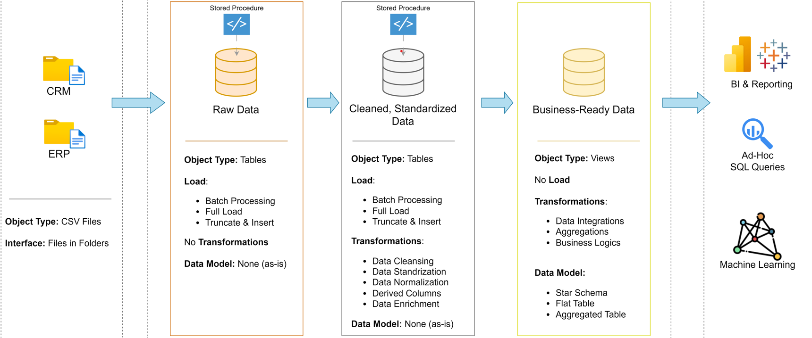

# SQL Data Warehouse Project

## Main Steps
1. **Requirements Analysis** 
2. **Design Data Architecture** 
3. **Project Initialization** 
4. **Build Bronze Layer** 
5. **Build Silver Layer** 
6. **Build Gold Layer** 

---

## Project Tasks

### 1️ Requirements Analysis  
- Analyse & Understand the Requirements  
    #### Building the Data Warehouse (Data Engineering)
    Develop a modern data warehouse using SQL Server to consolidate sales data, enabling analytical reporting and informed decision-making.

    #### Specifications
    - **Data Sources**: Import data from two source systems (ERP and CRM) provided as CSV files.
    - **Data Quality**: Cleanse and resolve data quality issues prior to analysis.
    - **Integration**: Combine both sources into a single, user-friendly data model designed for analytical queries.
    - **Scope**: Focus on the latest dataset only; historization of data is not required.
    - **Documentation**: Provide clear documentation of the data model to support both business stakeholders and analytics teams.


    #### BI: Analytics & Reporting (Data Analysis)
    Develop SQL-based analytics to deliver detailed insights into:
    - **Customer Behavior**
    - **Product Performance**
    - **Sales Trends**

    These insights empower stakeholders with key business metrics, enabling strategic decision-making.

### 2️ Design Data Architecture  
- Choose Data Management Approach  
- Design the Layers  
- Draw the Data Architecture

 
1. **Bronze Layer**: Stores raw data as-is from the source systems. Data is ingested from CSV Files into SQL Server Database.
2. **Silver Layer**: This layer includes data cleansing, standardization, and normalization processes to prepare data for analysis.
3. **Gold Layer**: Houses business-ready data modeled into a star schema required for reporting and analytics.

### 3️ Project Initialization   
- Define Project Naming Conventions  
- Create Database & Schemas
    ### Repository Structure
    ```
    data-warehouse-project/
    │
    ├── datasets/                           # Raw datasets(ERP and CRM) under CSV file.
    │
    ├── docs/                               # Project documentations
    │   ├── etl_theory.png               
    │   ├── data_architecture.png        
    │   ├── data_catalog.md           
    │   ├── data_flow.png               
    │   ├── data_model.png                  # Star schema
    │   ├── naming-conventions.md           # Consistent naming guidelines for tables, columns, and files
    │   ├── data_integration.png
    │
    ├── scripts/                            # SQL scripts for ETL
    │   ├── bronze/                         # Scripts for extracting and loading raw data
    │   ├── silver/                         # Scripts for cleaning and transforming data
    │   ├── gold/                           # Scripts for creating analytical models
    │
    ├── tests/                              # Test scripts and quality files
    │
    ├── README.md                           # Project overview and instructions
    ├── LICENSE                             # License information for the repository
    ```
---

### 4️ Build Bronze Layer  
- Analysing: Source Systems  
- Coding: Data Ingestion  
- Validating: Data Completeness & Schema Checks  
- Document: Draw Data Flow 

### 5 Build Silver Layer  
- Analysing: Explore & Understand Data  
- Document: Draw Data Integration  
- Coding: Data Cleansing  
- Validating: Data Correctness Checks  
- Document: Extend Data Flow   

### 6️ Build Gold Layer  
- Analysing: Explore Business Objects  
- Coding: Data Integration  
- Validating: Data Integration Checks  
- Document: Draw Data Model of Star Schema 
- Document: Create Data Catalog 
